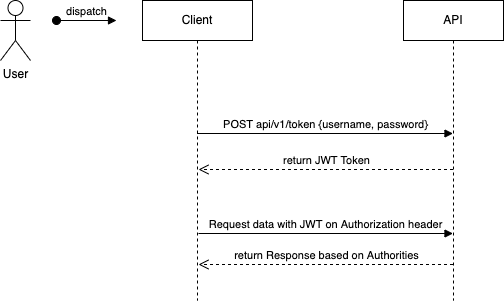
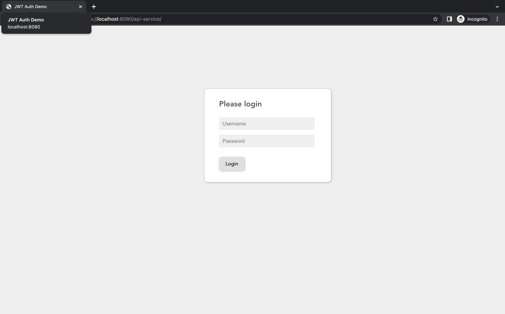
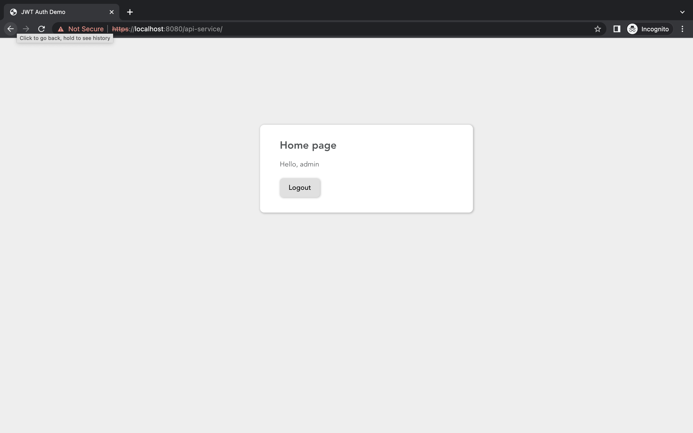

# JWT Auth Demo

### API based on Spring Security JWT

I use **openssl** which is installed by default on MacOS, but you should be able to get it whatever operating system you're running.

First, we need to generate RSA token:
```
openssl genrsa -out keypair.pem 2048
```
So, we generated RSA private key (keypair.pem). Then, from the private key we can extract the public key:
```
openssl rsa -in keypair.pem -pubout -out public.pem
```
Then, the private key needs to be in a pm encoded **pkcs8** format, otherwise we would end up getting an error in our application.
Let's make sure that we have private key in that format:
```
openssl pkcs8 -topk8 -inform PEM -outform PEM -nocrypt -in keypair.pem -out private.pem
```
Then we have an ability to get rid keypair.pem, because we aready have proper private and public keys.

Last step, we need to inform our application about the keys, by adding properties in our application.properties:
```
rsa.private-key=classpath:certs/private.pem
rsa.public-key=classpath:certs/public.pem
```

Now, we have secured Spring Boot REST APIs using JSON Web Tokens (JWT).




### How to Generate Self-Signed Certificate
Use the keytool command as below. You could mention the certificate name that you want, shown below.
```
keytool -genkeypair -alias selfsigned_localhost_sslserver -keyalg RSA -keysize 2048 -storetype PKCS12 -keystore reftch-ssl-key.p12 -validity 3650
```

### Applying the SSL to API

- Copy the reftch-ssl-key from the JDK bin folder and place it under the api/src/main/resources/ssl on your Spring Boot Application.
- Add the SSL Key information into application.properties as shown below.
```
# SSL Key Info
security.require-ssl=true
server.ssl.key-store-password=password
server.ssl.key-store=classpath:ssl/reftch-ssl-key.p12
server.ssl.key-store-type=PKCS12
```


### Building and running application

You build and test application by:
```
mvn clean install
```
Then, application is ready to run:
```
java -jar api/target/api-1.0.0-SNAPSHOT.jar
```



Enter demo credentials (admin/asdmin):



